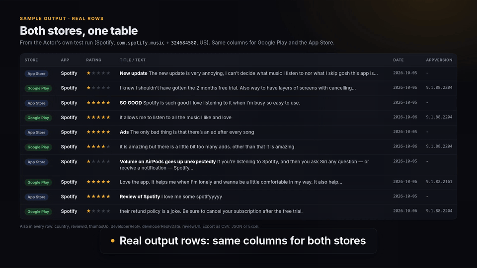
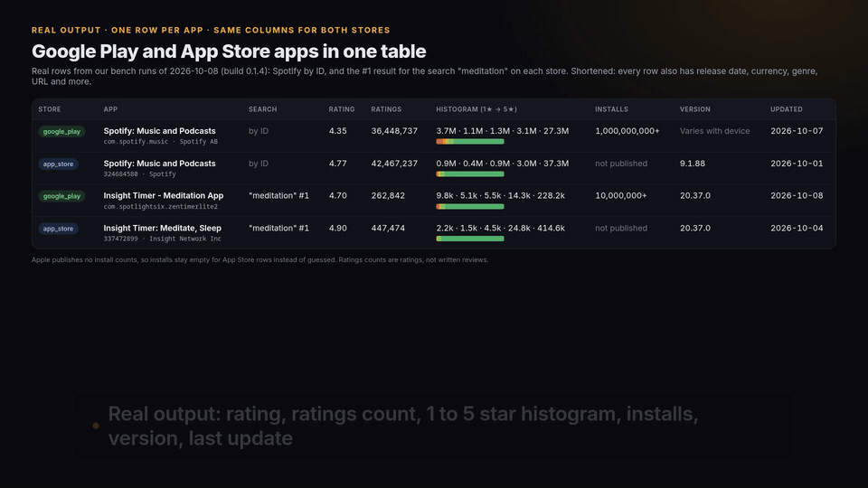

# App reviews from Google Play and the App Store in one CSV

Runnable Python and Node.js examples for [App Reviews Scraper: Google Play & App Store Reviews](https://apify.com/hiver/app-reviews-scraper?utm_source=github&utm_campaign=app-reviews-scraper), an Apify Actor built by hiver.

You give it apps from either store, mixed in one list: Google Play package names or URLs (`com.spotify.music`) and App Store IDs or URLs (`324684580`). You get one row per review with the same columns for both stores: store, app, country, rating, title, text, date, app version, helpful votes, developer reply and its date, review URL.

```
store,appId,appName,country,rating,title,text,date,appVersion,...
google,com.spotify.music,Spotify: Music and Podcasts,us,3,,"not sure why the podcasts queue will only play newest to oldest...",2026-10-06T21:44:38Z,9.1.86.2432,...
```



[Watch the 1-minute walkthrough (MP4, 1080p)](media/example-app-reviews/walkthrough.mp4)

## Run it

You need an Apify account (the free plan includes $5 of usage a month) and its API token from Apify Console > Settings > API & Integrations.

Python 3.11+:

```bash
cd python
pip install -r requirements.txt
export APIFY_TOKEN=your_token
python reviews_to_csv.py com.spotify.music 324684580 --ratings 1 2 --since 2026-10-01
```

Node.js 18+:

```bash
cd node
npm install
export APIFY_TOKEN=your_token
node reviews-to-csv.mjs com.spotify.music 324684580 --ratings 1,2 --since 2026-10-01
```

Both write `reviews.csv`. Options: `--countries us gb de` (each app is fetched once per country), `--ratings 1 2` (complaints only), `--since YYYY-MM-DD`, `--max` (reviews per app and country, up to 5,000), `--max-charge` (the run stops once it has cost this many dollars; default $1.00).

No code: open the [Actor page](https://apify.com/hiver/app-reviews-scraper?utm_source=github&utm_campaign=app-reviews-scraper), paste the apps and download CSV, Excel or JSON.

## What it costs

$0.09 per 1,000 reviews on the free plan, the same for both stores (a little less on higher Apify plans), plus Apify's $0.00005 start fee per run. Error rows, and reviews already returned in "only new" mode, are free. So $1 buys about 11,000 reviews.

## What we measured

Our test bench (2026-10-07, build 0.1.4) ran this Actor and three other Apify Store review Actors on the same two cases: the 20 newest US reviews of Spotify on the App Store, and the same on Google Play. Answers were checked against the stores' own pages (app name, rating range, app version, date, and a developer reply on Google Play).

| | This Actor | Other Store Actor covering both stores | Two App Store-only Actors |
|---|---|---|---|
| Checks passed | 8 of 8 | 7 of 8 | 3 of 8 each |
| Reviews returned (40 asked) | 40 | 40 | 10 each on the bench's free Apify plan, none for the Google Play app |
| Price per 1,000 reviews | $0.09 (was $0.25 during the bench) | $0.50 | $0.10 |

Two apps on one day is a small sample. The bench runs again after every new build. Field completeness was about the same as the other two-store Actor (86% vs 85%), so we do not claim an edge there.

## Monitoring

Turn on `onlyNew` with a `monitorId` in the Actor input and put it on an Apify schedule (hourly or daily). Each run returns only reviews that earlier runs with the same monitor ID did not, and you pay only for those. Apify integrations can send each run's new reviews to Slack, email, Google Sheets or a webhook.

## App details too: ratings, star histogram, installs, version

Reviews tell you what users say; app details tell you how the app stands. [App Store & Google Play Scraper](https://apify.com/hiver/app-store-google-play-scraper?utm_source=github&utm_campaign=app-reviews-scraper), also by hiver, returns one row per app with the same columns for both stores: rating, ratings count, the 1 to 5 star histogram, installs (Google Play only; Apple publishes none), price, version and last update. Search terms work too, and every search hit comes back with full details.



[Watch the 82-second walkthrough (MP4)](media/app-details/walkthrough.mp4)

On our test bench (2026-10-08, build 0.1.4: details for 4 apps and a "meditation" search in each store, checked against the stores' own pages) it matched 10 of 10 facts on Google Play and 10 of 10 on the App Store, and it was the only Actor tested that covers both stores in one run. The three other Store Actors tested were faster, and a low-cost Google Play-only Actor was cheaper. $1.90 per 1,000 apps on the free plan.

## Notes

- Unofficial. Not affiliated with, endorsed by or sponsored by Google or Apple. The Actor reads the public review pages that the stores show without logging in, and returns review content only: no reviewer profiles, photos or IDs.
- The stores show a limited window of reviews per country and language, so `--max` is an upper bound.
- Something wrong or missing? Open an issue on the Actor's Issues tab on Apify, or here.

MIT licensed examples. Built by [hiver](https://apify.com/hiver?utm_source=github&utm_campaign=app-reviews-scraper).
